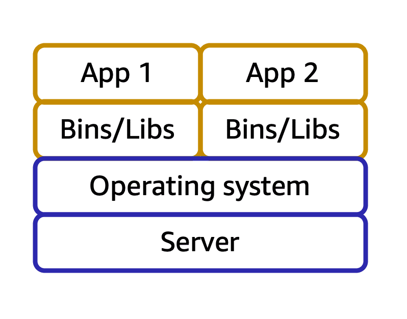

>[!IMPORTANT]
> _In AWS, you can also build and run containerized applications._

# Containers

Containers provide you with a standard way to package your application's code and dependencies into a single object. You can also use containers for processes and workflows in which there are essential requirements for security, reliability, and scalability.

To review an example on how containers work, choose the arrow buttons.

### One host with multiple containers

Suppose that a company’s application developer has an environment on their computer that is different from the environment on the computers used by the IT operations staff. The developer wants to ensure that the application’s environment remains consistent regardless of deployment, so they use a containerized approach. This helps to reduce time spent debugging applications and diagnosing differences in computing environments.

### Tens of hosts with hundreds of containers

When running containerized applications, it’s important to consider scalability. Suppose that instead of a single host with multiple containers, you have to manage tens of hosts with hundreds of containers. Alternatively, you have to manage possibly hundreds of hosts with thousands of containers. At a large scale, imagine how much time it might take for you to monitor memory usage, security, logging, and so on.

## Amazon Elastic Container Service (Amazon ECS)

[**Amazon Elastic Container**](https://aws.amazon.com/ecs/) Service (Amazon ECS) is a highly scalable, high-performance container management system that enables you to run and scale containerized applications on AWS. 

Amazon ECS supports Docker containers. Docker is a software platform that enables you to build, test, and deploy applications quickly. AWS supports the use of open-source Docker Community Edition and subscription-based Docker Enterprise Edition. With Amazon ECS, you can use API calls to launch and stop Docker-enabled applications.

## Amazon Elastic Kubernetes Service (Amazon EKS)

[**Amazon Elastic Kubernetes**](https://aws.amazon.com/eks/) Service (Amazon EKS) is a fully managed service that you can use to run Kubernetes on AWS. 

Kubernetes is open-source software that enables you to deploy and manage containerized applications at scale. A large community of volunteers maintains Kubernetes, and AWS actively works together with the Kubernetes community. As new features and functionalities release for Kubernetes applications, you can easily apply these updates to your applications managed by Amazon EKS.

## AWS Fargate

[**AWS Fargate**](https://aws.amazon.com/fargate/) is a serverless compute engine for containers. It works with both Amazon ECS and Amazon EKS. 

When using AWS Fargate, you do not need to provision or manage servers. AWS Fargate manages your server infrastructure for you. You can focus more on innovating and developing your applications, and you pay only for the resources that are required to run your containers.