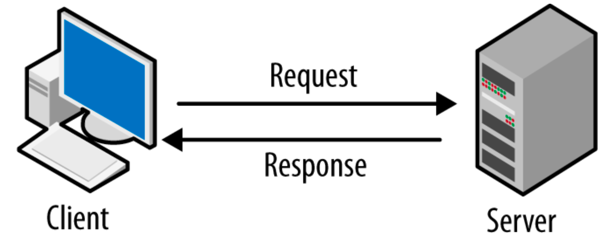

# AWS Model 

pay for what you need, becomes the first key value of many for running your business on AWS. And that is really why we're here, to help you understand how AWS is built to help you run your business better.

And in today bussines in a simple example is like having a coffee shop, in where you can find the following problems:

* You have a hard time in high hours like the breakfast and lunch time, so you need more employees.
* After these times you don't need those employees anymore, you just need one or two.
* But if something unexpected happens, what are you going to do? You can't wait for employees while your local is collapsing.
* So you need the capacity to maintain these features without paying more money.

### Client Server Model

You just learned more about AWS and how almost all of modern computing uses a basic **client-server model**. Let’s recap what a client-server model is. Client on left, server on right. Arrows pointing from client to
server and from server to client to indicate a transaction.
In computing, a **client can be a web browser or desktop application** that a person interacts
with to make requests to computer servers. **A server can be services, such as Amazon Elastic Compute Cloud (Amazon EC2) – a type of virtual server**.  For example, suppose that a client makes a request for a news article, the score in an online
game, or  a funny video. The server evaluates the details of this request and fulfills it by returning the 
information to the client.

